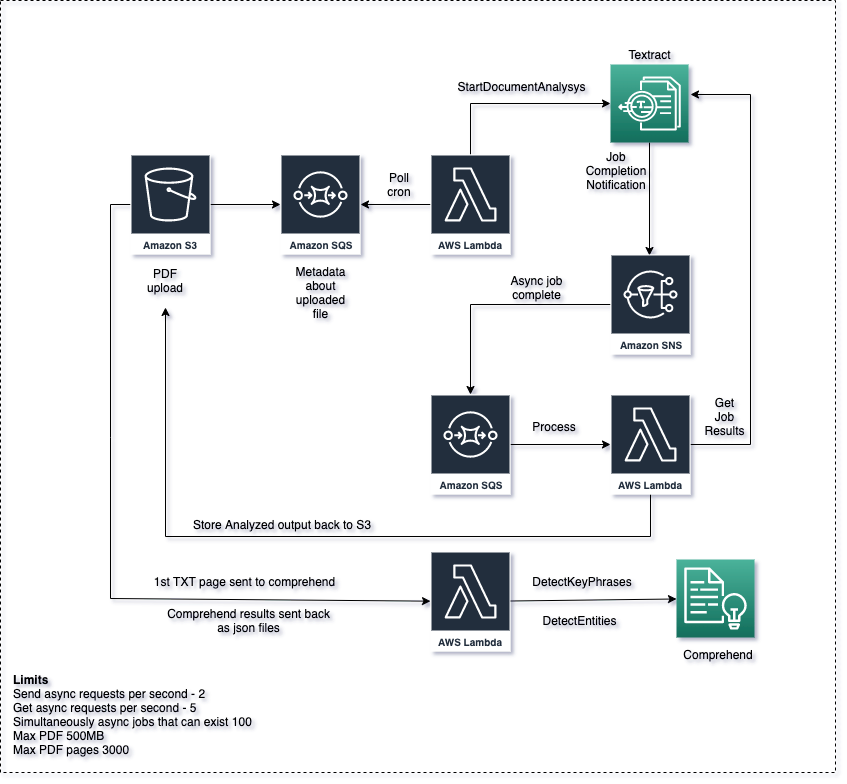

## Architecture PoC

Architecture below shows the core components. 



TODO: There are multiple todo items here, I will be working on them next. Just wanted to bring up quick MVP to test out.

## Install
(These instructions assume you run MAC OS)
How to install the infrastructure via terraform

### Initialize
Assumes you have default credentials in default location.
If you store credentials in custom location change the path below.
If you have custom profile add extra argument `-e AWS_PROFILE=custom`.
```shell script
cd terraform/
docker run --rm -it \
  -v $PWD:/opt \
  -w /opt \
  -v $HOME/.aws/credentials:/root/.aws/credentials \
  hashicorp/terraform:0.13.0 init
```
### Plan
```shell script
docker run --rm -it \
  -v $PWD:/opt \
  -w /opt \
  -v $HOME/.aws/credentials:/root/.aws/credentials \
  hashicorp/terraform:0.13.0 plan
```
### Apply
```shell script
docker run --rm -it \
  -v $PWD:/opt \
  -w /opt \
  -v $HOME/.aws/credentials:/root/.aws/credentials \
  hashicorp/terraform:0.13.0 apply
```

### Cleanup / Destroy
```shell script
docker run --rm -it \
  -v $PWD:/opt \
  -w /opt \
  -v $HOME/.aws/credentials:/root/.aws/credentials \
  hashicorp/terraform:0.13.0 destroy
```
